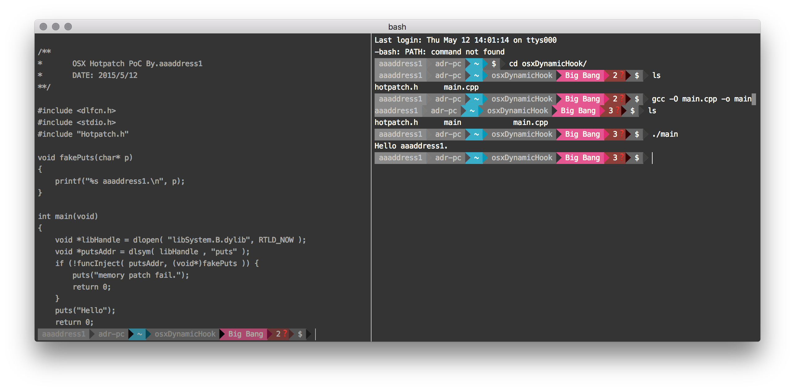
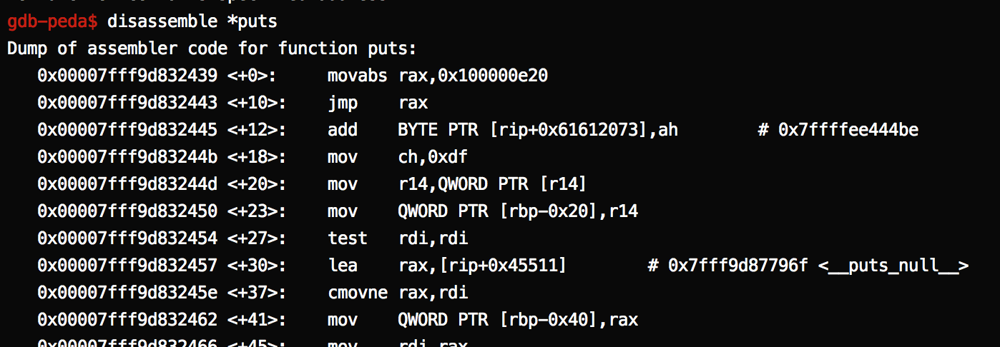

#OSX Dynamic Function Hook

It is a simple proof of concept to hook on the memory, and it works on OSX 10.11.4 (x86_x64) well at May 13, 2015. You can include `hotpatch.h` and easily to hook any function.

##How to use?
> \#include \<hotpatch.h\>

You must include my framework so that you can hook what you want.

> bool funcHookOn(void* orgFunc,void * newFunc,void *saveData)

You can redirect the calling from orgFunc to newFunc. For example, you want to set a hook on `rand`:

	libHandle = dlopen( "libSystem.B.dylib", RTLD_NOW );
	randAddr = dlsym( libHandle , "rand" );    
	data = malloc(payloadSize);   
	funcHookOn( randAddr, (void*)fakeRand, data );

> bool funcHookOn(void* orgFunc,void * newFunc,void *saveData)

`funcHookOn` is used for uninstall the hook. It's helpful when you need to let the function which is hooked work normally.

##How it works?
e.g. Hooking the `puts` function

This is the disassembly result of original `puts` function.
We want to let every thread entering this function, and jump to another function. 

I make a simple payload on the begin of `puts` function:

Let the content of register rax be the pointer of our fake function `movabs rax, ptr` in memory, and using `jmp rax` to jump back our fake function.